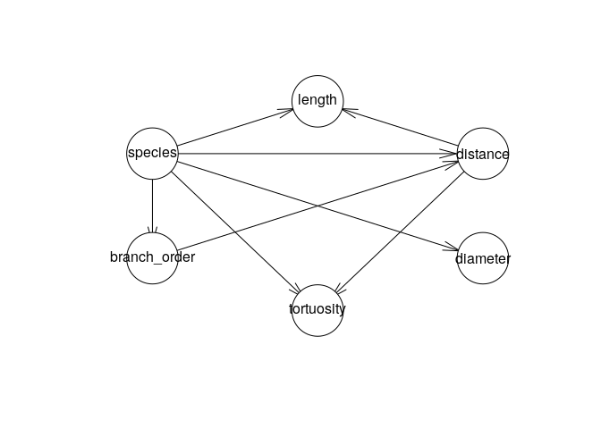
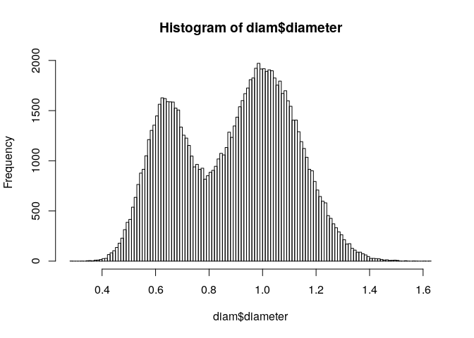

What
====

This repository contains the Bayesian network models underlying our
paper, [‘Comparing basal dendrite branches in human and mouse
hippocampal CA1 pyramidal neurons with Bayesian
networks’](https://www.biorxiv.org/content/10.1101/2020.03.14.991828v1).
There is detailed documentation on the models in the paper.

The models are
[`bnlearn`](https://cran.r-project.org/web/packages/bnlearn/index.html)
objects. You can use them for analyzing structure and conditional
independencies as well as for probabilistic inference. The following is
a plot of the Bayesian network for the morphology of terminal basal
dendritic branches:

    load('models/bn_term.rdata') 
    bn <- bnlearn::bn.net(bn_term)
    plot(bn)

The following shows that `length` is independent of `diameter` given
`species` in the network.

    bnlearn::dsep('length', 'diameter', 'species', bn = bn)

    ## [1] TRUE

<!-- The parameters of the local are easily inspected with  -->
The repository contains 9 different Bayesian networks. Namely, we
learned networks from three different subsets of our data: (a) from
terminal branches alone; (b) from non-terminal branches alone; and (c)
from both terminal and non-terminal branches. Within each data subset
(that is, (a), (b), and (c)), we learned a separate Bayesian network
model for each species as well as a combined Bayesian network model for
both species.

Install and load bnlearn
========================

You will need the `bnlearn` R package.

    # install.packages('bnlearn')

    library(bnlearn)

Load the models
===============

The Bayesian networks are located in the `models` folder, as `R`
objects. The `load()` function makes them available in memory. Their
name is the name of their file, minus the extension (e.g., the model of
human terminal branches is contained in object `bn_term_human`).

Terminal branches
-----------------

    load('models/bn_term.rdata') # bn_term 
    load('models/bn_term_human.rdata') # bn_term_human 
    load('models/bn_term_mouse.rdata') # bn_term_mouse

Non-terminal branches
---------------------

    load('models/bn_nonterm.rdata') # bn_nonterm 
    load('models/bn_nonterm_human.rdata') # bn_nonterm_human 
    load('models/bn_nonterm_mouse.rdata') # bn_nonterm_mouse

All branches
------------

    load('models/bn.rdata') # bn
    load('models/bn_human.rdata') # bn_human 
    load('models/bn_mouse.rdata') # bn_mouse

Using the models
================

The models are `bn.fit` objects (see bnlearn documentation) which means
that they can readily be used for inference and prediction. For example,
we may sample from and then plot the marginal distribution of branch
diameter in terminal branches of both species:

    diam <- cpdist(bn_term, nodes = 'diameter', evidence = TRUE, n = 1e5)
    hist(diam$diameter, breaks = 100)

 There are
two modes because human branches are thicker than mouse ones.

If we want to analyze the networks (e.g., plot the structure, assess
conditional independencies with the d-separation criterion) we need to
convert the `bn.fit` object into a `bn` object, with `bn.net()`:

    bn <- bnlearn::bn.net(bn_term)
    dsep(bn, 'diameter', 'length')

    ## [1] FALSE

    dsep(bn, 'diameter', 'length', 'species')

    ## [1] TRUE
